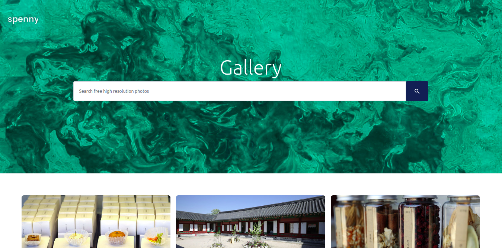

# Image Gallery
[Live Demo](https://aniketkishore100.github.io/ImageGallery/)

Image Gallery is a dynamic online High Resolution Image Viewing Responsive Platform which uses Flicker API to fetch the images according to the user-query.

The User can enter the required query keyword on the search bar present at the starting of the web page or can scroll down to enable the static header on the top of the web page

## Key Features
- Cross-Browser Responsive Design
- High Resolution Images
- Dynamic Navbar
- Infinte Scrolling Enabled
- Attractive Masonry Grid for Images

## Getting Started

- Clone the Project on your local system
- Navigate to the root Folder
- Run `npm install` on your terminal
- Run `npm start` to deploy the website on `http://localhost:3000/`

## Screenshots
### Banner :

### Image Grid :

